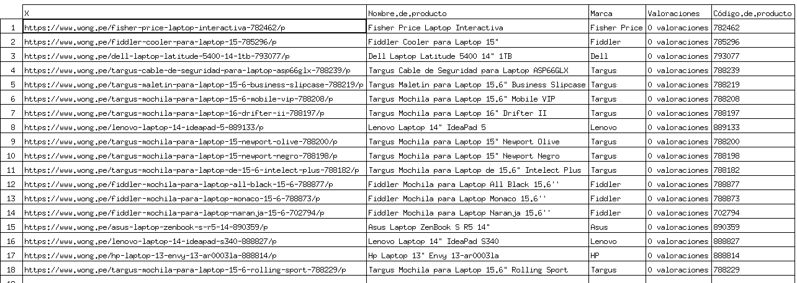
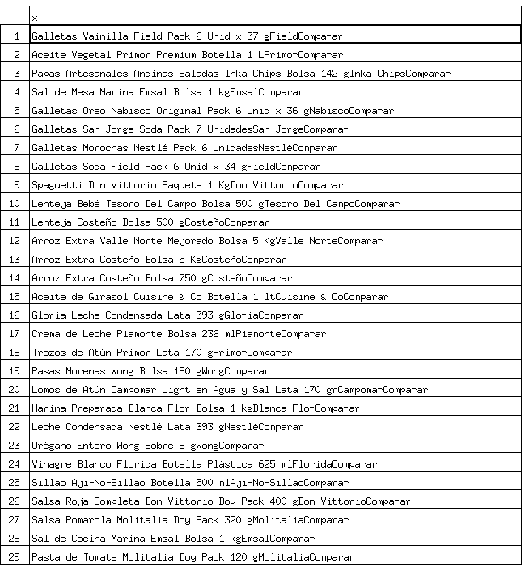
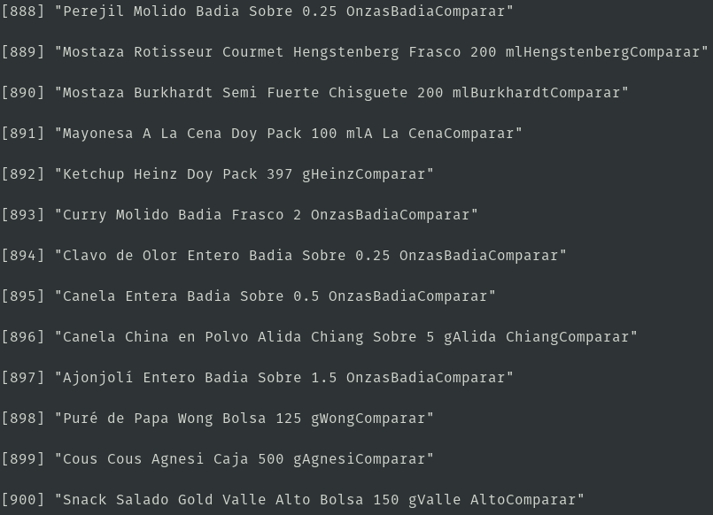
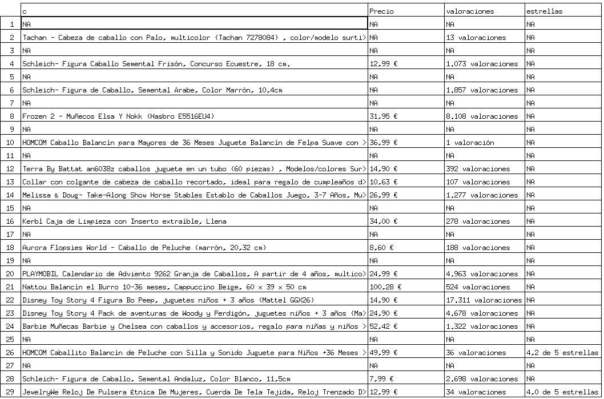
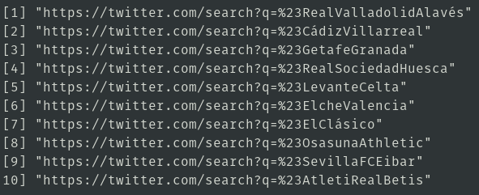
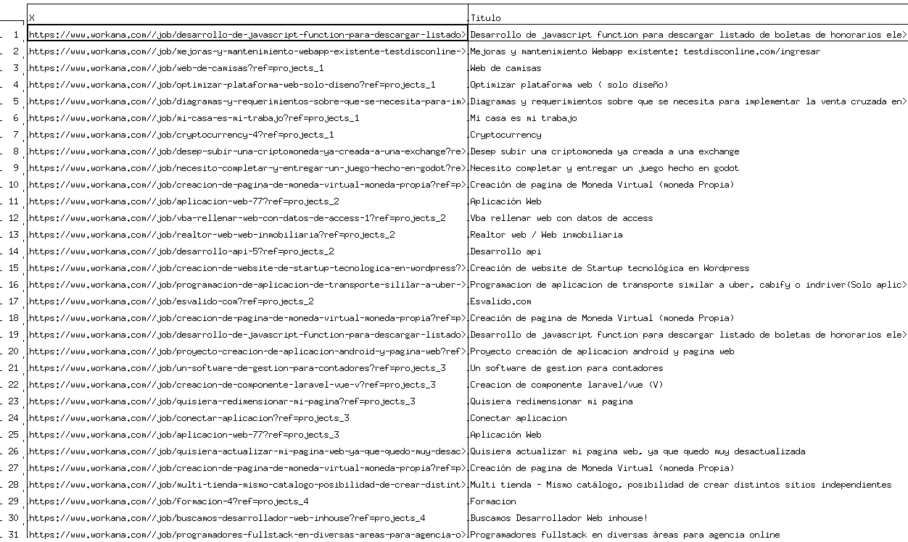

# Web Scraping
## Recolectar data de laptop de la tienda Wong
1. codigo.R
	```r
	library(rvest)
	url<-"https://www.wong.pe/busca/?ft=laptop"
	pagina <- read_html(url)
	selector <- "div.product-item__bottom > div.product-item__info > a"
	nodo <- html_nodes(pagina,selector)
	text <- html_text(nodo)
	links <- html_attr(nodo,"href")
	links

	getArticulo<-function(url){
	#url<-"https://www.wong.pe/fiddler-cooler-para-laptop-15-785296/p"
	pagina_web<-read_html(url)
	nombre<-"#product-nonfood-page > div.wrapper.product-wrapper > div > div.product-content > div.inner.product > div.product-info > div.info-wrapper > div.name > div"
	nombre_nodo<-html_node(pagina_web, nombre)
	nombre_texto<-html_text(nombre_nodo)

	marca<-"#product-nonfood-page > div.wrapper.product-wrapper > div > div.product-content > div.inner.product > div.product-info > div.info-wrapper > div.aditional-info > span.brand > div > a"
	marca_nodo<-html_node(pagina_web,marca)
	marca_texto<-html_text(marca_nodo)

	valoraciones<-"#product-nonfood-page > div.wrapper.product-wrapper > div > div.product-content > div.inner.product > div.product-info > div.info-wrapper > div.reviews__rating.reviews__rating--product-wrapper.desktop > div.reviews__rating-amount > div"
	valoraciones_nodo<-html_node(pagina_web,valoraciones)
	valoraciones_texto<-html_text(valoraciones_nodo)

	codigo<-"#product-nonfood-page > div.wrapper.product-wrapper > div > div.product-content > div.inner.product > div.product-info > div.info-wrapper > div.aditional-info > span.code > div"
	codigo_nodo<-html_node(pagina_web,codigo)
	codigo_texto<-html_text(codigo_nodo)

	articulo<-c(nombre_texto,marca_texto,valoraciones_texto,codigo_texto)
	articulo
	}
	datos<-sapply(links,getArticulo)
	b<-t(datos)
	colnames(b)<-c("Nombre de producto","Marca","Valoraciones","Código de producto")
	b
	write.csv(b,"laptop.csv")
	```
2. Output
	
## Scrolling
1. codigo.R
	```r
	library(RSelenium)
	library(rvest)
	#start RSelenium
	driver<-rsDriver(port=4569L,browser="chrome",chromever="85.0.4183.83")
	remDr <- driver[["client"]]
	#navigate to your page
	remDr$navigate("https://www.wong.pe/abarrotes")
	#scroll down 5 times, waiting for the page to load at each time
	for(i in 1:60){
	remDr$executeScript(paste("scroll(0,",i*10000,");"))
	Sys.sleep(3)    
	}
	#get the page html
	page_source<-remDr$getPageSource()
	#parse it
	a<-read_html(page_source[[1]]) %>% html_nodes(".product-item__info") %>% html_text()
	b<-gsub('[\r\n\t]','',a)
	write.csv(b,"productos.csv")
	```
2. Output  
	  
	  
## Paginación
1. codigo.R
	```r
	library(rvest)
	paginas<-paste0("https://www.amazon.es/s?k=caballo&page=",c(1:2),"&__mk_es_ES=%C3%85M%C3%85%C5%BD%C3%95%C3%91&qid=1601617471&ref=sr_pg_",c(1:2))
	linksPagina<-function(url){
	#url<-"https://www.amazon.es/s?k=caballo&page=3&__mk_es_ES=%C3%85M%C3%85%C5%BD%C3%95%C3%91&qid=1601617471&ref=sr_pg_3"
	pagina<-read_html(url)
	selector<-"div > div > div:nth-child(3) > h2 > a"
	nodo<-html_nodes(pagina,selector)
	links<-html_attr(nodo,"href")
	links<-paste0("https://amazon.es/",links)
	}

	datosProducto<-function(url){
	#library(rvest)
	#url<-"https://www.amazon.es/Happy-People-58980-importado-Alemania/dp/B003YGDCBQ/ref=sr_1_102?__mk_es_ES=%C3%85M%C3%85%C5%BD%C3%95%C3%91&dchild=1&keywords=caballo&qid=1601617471&sr=8-102"
	pagina<-read_html(url)
	#nombre
	nombre<-"#productTitle"
	nombre_nodo<-html_node(pagina,nombre)
	nombre_texto<-html_text(nombre_nodo)
	#precio
	precio<-"#priceblock_ourprice"
	precio_nodo<-html_node(pagina,precio)
	precio_texto<-html_text(precio_nodo)
	#valoracion
	valoracion<-"#acrCustomerReviewText"
	valoracion_nodo<-html_node(pagina,valoracion)
	valoracion_texto<-html_text(valoracion_nodo)
	#estrellas
	estrellas<-"#acrPopover > span.a-declarative > a > i.a-icon.a-icon-star.a-star-4"
	estrellas_nodo<-html_node(pagina,estrellas)
	estrellas_texto<-html_text(estrellas_nodo)
	producto<-c(nombre_texto,precio_texto,valoracion_texto,estrellas_texto)
	producto
	}

	links<-sapply(paginas,linksPagina)
	a<-as.vector(unlist(links))
	datos<-sapply(a,datosProducto)
	names(datos)<-NULL
	b<-t(datos)
	colnames(b)<-c("Nombre del producto","Precio","valoraciones","estrellas")
	rownames(b)<-NULL
	c<-gsub('[\n]','',b[,1])
	d<-cbind(c,b[,2:4])
	write.csv(d,"paginacion.csv")
	```
2. Output
	

## Hashtag: partidos de la liga
1. `codigo`
	```r
	library(rvest)
	library(rjson)
	clubs_list_url <- 'https://www.laliga.es'
	clubs_list_page <- read_html(clubs_list_url)
	json_data <- html_node(clubs_list_page, '#__NEXT_DATA__')
	json_data_value <- html_text(json_data)
	teams_data <- fromJSON(json_data_value)
	a=c()
	for (i in 1:10){
		a=c(a,teams_data$props$pageProps$layout$containers[[1]]$modules[[2]]$content[[i]]$hashtag)
	}
	b<-paste0("https://twitter.com/search?q=%23",a)
	b
	```
2. output  
	

## Obtener datos de los trabajos disponibles en Workana respecto a un item específico
1. `codigo.R`
	```r
	library(rvest)
	paginas<-paste0("https://www.workana.com/jobs?language=es&skills=javascript&page=",c(1:5))
	linksPagina<-function(url){
	#url<-"https://www.workana.com/jobs?language=es&skills=javascript&page=1"
	pagina<-read_html(url)
	selector <- "div.project-header > h2 > a"
	nodo<-html_nodes(pagina,selector)
	links<-html_attr(nodo,"href")
	links<- paste0("https://www.workana.com/",links)
	}
	datosTrabajo<-function(url){
	#library(rvest)
	#url<-"https://www.workana.com//job/programadores-fullstack-en-diversas-areas-para-agencia-online?ref=projects_1" 
	pagina<-read_html(url)
	#titulo
	titulo<-"#productName > h1"
	titulo_nodo<-html_node(pagina,titulo)
	titulo_texto<-html_text(titulo_nodo)
	#publicado
	publicado<-"#productName > p"
	publicado_nodo<-html_node(pagina,publicado)
	publicado_texto<-html_text(publicado_nodo)
	#presupuesto
	presupuesto<-"#app > div > div.container.main > section > section.box-common.block-project > div > section > article > div.row > div:nth-child(2) > h4"
	presupuesto_nodo<-html_node(pagina,presupuesto)
	presupuesto_texto<-html_text(presupuesto_nodo)
	#categoria
	categoria<-"#app > div > div.container.main > section > section.box-common.block-project > div > section > article > p.resume > strong:nth-child(1)"
	categoria_nodo<-html_node(pagina,categoria)
	categoria_texto<-html_text(categoria_nodo)
	#subcategoria
	subcategoria<-"#app > div > div.container.main > section > section.box-common.block-project > div > section > article > p.resume > strong:nth-child(3)"
	subcategoria_nodo<-html_node(pagina,subcategoria)
	subcategoria_texto<-html_text(subcategoria_nodo)
	#habilidades
	habilidades<-"#app > div > div.container.main > section > section.box-common.block-project > div > section > article > p.skills"
	habilidades_nodo<-html_node(pagina,habilidades)
	habilidades_texto<-html_text(habilidades_nodo)
	producto<-c(titulo_texto,publicado_texto,presupuesto_texto,categoria_texto,subcategoria_texto,habilidades_texto)
	producto
	}
	links<-sapply(paginas,linksPagina)
	a<-as.vector(unlist(links))
	datos<-sapply(a,datosTrabajo)
	names(datos)<-NULL
	b<-t(datos)
	b<-data.frame(b)
	colnames(b)<-c("Titulo","Publicado","Presupuesto","Categoria","Subcategoria","Habilidades")
	#rownames(b)<-NULL
	b$Titulo<-gsub('[\n]',"",b$Titulo)
	b$Titulo<-gsub('                ',"",b$Titulo)
	b$Titulo<-gsub('            ',"",b$Titulo)
	b$Publicado<-gsub('[\n]',"",b$Publicado)
	b$Publicado<-gsub('                ',"",b$Publicado)
	b$Publicado<-gsub('            ',"",b$Publicado)
	b$Presupuesto<-gsub('[\n]',"",b$Presupuesto)
	b$Presupuesto<-gsub('                                    ',"",b$Presupuesto)
	b$Presupuesto<-gsub('                                ',"",b$Presupuesto)
	b$Habilidades<-gsub('[\n]',"",b$Habilidades)
	b$Habilidades<-gsub('                            ',"",b$Habilidades)
	b$Habilidades<-gsub('                        ',"",b$Habilidades)
	write.csv(b,"workana.csv")
	```
2. output: `workana.csv` (buscando trabajos relacionados con javascript)  
	
