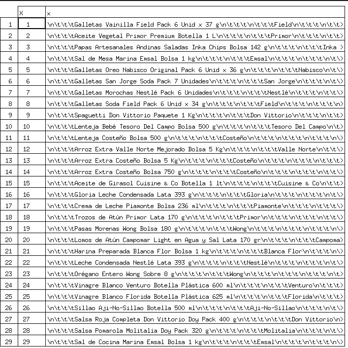
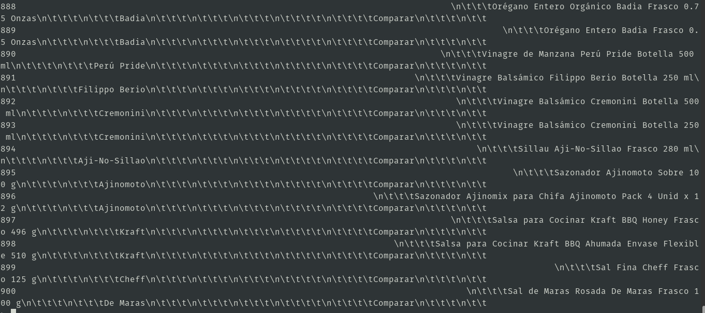

# Web Scraping
## Recolectar data de laptop de la tienda Wong
1. codigo.R
	```r
	library(rvest)
	url<-"https://www.wong.pe/busca/?ft=laptop"
	pagina <- read_html(url)
	selector <- "div.product-item__bottom > div.product-item__info > a"
	nodo <- html_nodes(pagina,selector)
	text <- html_text(nodo)
	links <- html_attr(nodo,"href")
	links

	getArticulo<-function(url){
	#url<-"https://www.wong.pe/fiddler-cooler-para-laptop-15-785296/p"
	pagina_web<-read_html(url)
	nombre<-"#product-nonfood-page > div.wrapper.product-wrapper > div > div.product-content > div.inner.product > div.product-info > div.info-wrapper > div.name > div"
	nombre_nodo<-html_node(pagina_web, nombre)
	nombre_texto<-html_text(nombre_nodo)

	marca<-"#product-nonfood-page > div.wrapper.product-wrapper > div > div.product-content > div.inner.product > div.product-info > div.info-wrapper > div.aditional-info > span.brand > div > a"
	marca_nodo<-html_node(pagina_web,marca)
	marca_texto<-html_text(marca_nodo)

	valoraciones<-"#product-nonfood-page > div.wrapper.product-wrapper > div > div.product-content > div.inner.product > div.product-info > div.info-wrapper > div.reviews__rating.reviews__rating--product-wrapper.desktop > div.reviews__rating-amount > div"
	valoraciones_nodo<-html_node(pagina_web,valoraciones)
	valoraciones_texto<-html_text(valoraciones_nodo)

	codigo<-"#product-nonfood-page > div.wrapper.product-wrapper > div > div.product-content > div.inner.product > div.product-info > div.info-wrapper > div.aditional-info > span.code > div"
	codigo_nodo<-html_node(pagina_web,codigo)
	codigo_texto<-html_text(codigo_nodo)

	articulo<-c(nombre_texto,marca_texto,valoraciones_texto,codigo_texto)
	articulo
	}
	datos<-sapply(links,getArticulo)
	b<-t(datos)
	colnames(b)<-c("Nombre de producto","Marca","Valoraciones","Código de producto")
	b
	write.csv(b,"laptop.csv")
	```
2. Output
	
## Scrolling
1. codigo.R
	```r
	library(RSelenium)
	library(rvest)
	#start RSelenium
	driver<-rsDriver(port=4568L,browser="chrome",chromever="85.0.4183.83")
	remDr <- driver[["client"]]
	#navigate to your page
	remDr$navigate("https://www.wong.pe/abarrotes")
	#scroll down 5 times, waiting for the page to load at each time
	for(i in 1:60){
	remDr$executeScript(paste("scroll(0,",i*10000,");"))
	Sys.sleep(3)    
	}
	#get the page html
	page_source<-remDr$getPageSource()
	#parse it
	a<-read_html(page_source[[1]]) %>% html_nodes(".product-item__info") %>% html_text()
	write.csv(a,"productos.csv")
	```
2. Output  
	  
	  
